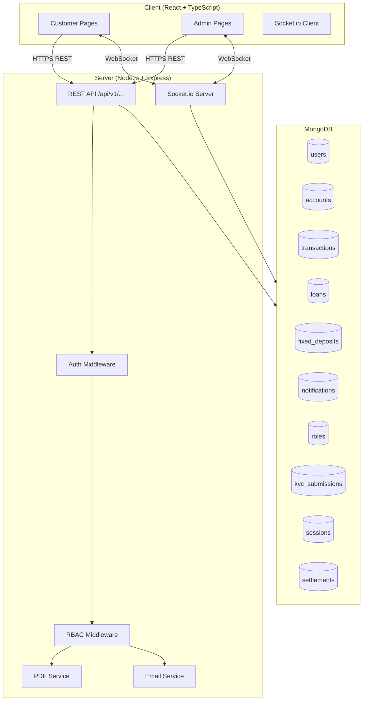

# STARK Digital Banking Platform — Design Document

## Overview

STARK is a full-stack online banking platform built on a monorepo architecture. It exposes two distinct surfaces:

- **Customer surface** — a mobile-first React web app covering account management, money movement, loans, and investments.
- **Admin surface** — a desktop-first React dashboard for internal operators covering analytics, user management, transaction operations, KYC, and role management.

The platform is built with React + TypeScript + Tailwind CSS on the frontend, Node.js + Express on the backend, and MongoDB with Mongoose as the database. Real-time features are powered by Socket.io. The UI follows the "Digital Vault" design system extracted from the eight pre-built HTML screens in `stitch_stark_digital_banking_platform/`.

### UI Screen Inventory

| Screen | Path | Surface | Maps to Requirements |
|---|---|---|---|
| customer_dashboard | `stitch_stark_digital_banking_platform/customer_dashboard/` | Customer | Req 2, 15 |
| transaction_history | `stitch_stark_digital_banking_platform/transaction_history/` | Customer | Req 3, 4 |
| transfer_hub | `stitch_stark_digital_banking_platform/transfer_hub/` | Customer | Req 6 |
| loans_credit | `stitch_stark_digital_banking_platform/loans_credit/` | Customer | Req 7 |
| investment_center | `stitch_stark_digital_banking_platform/investment_center/` | Customer | Req 8 |
| admin_overview | `stitch_stark_digital_banking_platform/admin_overview/` | Admin | Req 9 |
| admin_operations | `stitch_stark_digital_banking_platform/admin_operations/` | Admin | Req 12, 13 |
| user_management | `stitch_stark_digital_banking_platform/user_management/` | Admin | Req 10, 11, 14 |

---

## Architecture

### Monorepo Structure

```
/
├── client/                    # React + TypeScript + Tailwind
│   ├── src/
│   │   ├── pages/
│   │   │   ├── customer/      # Dashboard, History, Transfer, Loans, Investments
│   │   │   └── admin/         # Overview, Operations, UserManagement
│   │   ├── components/
│   │   │   ├── ui/            # Design system primitives
│   │   │   └── features/      # Feature-specific components
│   │   ├── hooks/
│   │   ├── services/          # API client functions
│   │   ├── store/
│   │   └── types/             # Re-exported from /shared
│   └── tailwind.config.ts
│
├── server/                    # Node.js + Express
│   ├── src/
│   │   ├── routes/            # /api/v1/...
│   │   ├── controllers/
│   │   ├── middleware/        # Auth, RBAC, rate-limiting, error handling
│   │   ├── models/            # Mongoose schemas
│   │   ├── services/          # Transfer, loan, PDF, email, socket services
│   │   ├── sockets/           # Socket.io event handlers
│   │   └── utils/
│   └── index.ts
│
└── shared/                    # Shared TypeScript types
    └── types/
```

### System Architecture Diagram



### Request Flow

1. Client sends HTTPS request with `Authorization: Bearer <JWT>` header.
2. Auth middleware validates JWT, attaches `req.user`.
3. RBAC middleware checks `req.user.role` against the route's required permission.
4. Controller executes business logic via Mongoose models.
5. Response returned; Socket.io broadcasts relevant events to connected clients.

### Real-time Architecture

Socket.io rooms scope events:
- `user:{userId}` — per-customer balance updates and notifications.
- `admin:activity` — platform-wide activity feed for all connected admins.
- `admin:approvals` — approval queue updates.

---

## Components and Interfaces

### Design System (Digital Vault)

```typescript
// tailwind.config.ts — Digital Vault tokens
export default {
  theme: {
    extend: {
      colors: {
        primary: '#000000',
        'primary-container': '#0d1c32',
        'on-primary': '#ffffff',
        'on-primary-container': '#76849f',
        secondary: '#775a19',
        'secondary-container': '#fed488',
        'secondary-fixed-dim': '#e9c176',
        surface: '#f8f9fa',
        'surface-container-low': '#f3f4f5',
        'surface-container': '#edeeef',
        'surface-container-high': '#e7e8e9',
        'surface-container-lowest': '#ffffff',
        'on-surface': '#191c1d',
        'on-surface-variant': '#44474d',
        outline: '#75777e',
        'outline-variant': '#c5c6cd',
        error: '#ba1a1a',
        'error-container': '#ffdad6',
      },
      borderRadius: { DEFAULT: '0.125rem', lg: '0.25rem', xl: '0.5rem', full: '0.75rem' },
      fontFamily: { headline: ['Manrope'], body: ['Inter'], label: ['Inter'] },
    },
  },
}
```

### Customer Surface Components

**CustomerDashboard** (`/pages/customer/Dashboard.tsx`)
Source: `customer_dashboard/code.html`
- `AccountCarousel` — horizontally scrollable account cards (Savings/Current/Domiciliary), masked account number, live balance. Subscribes to `user:{userId}` socket room.
- `QuickActionsGrid` — 3-column bento: Transfer, Pay Bills, Deposit.
- `SavingsGoalMeter` — gradient progress bar, amount vs. target.
- `RecentTransactions` — last 3 transactions grouped by date (Today/Yesterday/Earlier).
- `FABQRScanner` — fixed bottom-right FAB.

**TransactionHistory** (`/pages/customer/TransactionHistory.tsx`)
Source: `transaction_history/code.html`
- `TransactionSearchBar` — debounced text search (300ms).
- `FilterChips` — All / Incoming / Outgoing.
- `StatementDownloadCard` — dark hero card with 3-month / 6-month / 1-year download buttons.
- `TransactionList` — date-grouped rows with merchant icon, name, category, amount, time.
- `MonthlyLimitMeter` — spend vs. limit progress bar.

**TransferHub** (`/pages/customer/TransferHub.tsx`)
Source: `transfer_hub/code.html`
- `TransferTypeToggle` — Intra-bank (Free) / International segmented control.
- `RecentRecipientsCarousel` — scrollable recipient avatars + "New" button.
- `AmountEntryForm` — large amount input with USD/EUR/GBP currency selector.
- `TransactionSummaryPanel` — dark card: fee, arrival time, total deducted.
- `InitializeTransferButton` — full-width CTA.

**LoansCredit** (`/pages/customer/Loans.tsx`)
Source: `loans_credit/code.html`
- `CreditLimitHero` — dark hero: credit limit, available amount, tier badge, utilisation bar.
- `LoanCalculator` — range slider, monthly payment and APR display.
- `SalaryAdvanceCard`, `DeviceFinancingCard`, `BusinessGrowthLoanCard` — product cards.

**InvestmentCenter** (`/pages/customer/Investments.tsx`)
Source: `investment_center/code.html`
- `PortfolioValueHero` — total value with YTD growth.
- `ProjectedWealthChart` — bar chart in dark hero card.
- `ActiveDepositsList` — fixed deposit cards (APY, maturity date, current value, progress bar).
- `CreateDepositButton` — full-width secondary CTA.

### Admin Surface Components

**AdminOverview** (`/pages/admin/Overview.tsx`)
Source: `admin_overview/code.html`
- `AdminSidebar` — fixed left nav, active state `border-r-4 border-secondary`.
- `MetricsBentoGrid` — Total Users, Revenue Today, Active Orders.
- `UserRetentionChart` — bar chart with 7D/30D/1Y toggle.
- `SecurityHealthCards` — Security Protocols, System Health.
- `ActivityFeed` — sticky right panel, real-time events from `admin:activity` socket room.

**AdminOperations** (`/pages/admin/Operations.tsx`)
Source: `admin_operations/code.html`
- `FinancialOverviewStats` — Total Volume, Queue Status, Failed Rate.
- `TransactionLogTabs` — All Logs / Manual Approvals / Failed Transactions.
- `FilterExportBar` — filter, date range, Export Ledger (CSV).
- `LedgerTable` — ID / Beneficiary / Type / Amount / Status / Actions (Approve, Flag, Investigate).

**UserManagement** (`/pages/admin/UserManagement.tsx`)
Source: `user_management/code.html`
- `UserStatsBento` — Total Users, Pending KYC, Suspended, System Health.
- `UserSearchFilterBar` — search + Advanced Filters + Export + Create User.
- `UserTable` — Identity / Status / KYC Level / Date Joined / Actions.
- `MassActionBar` — floating bar (visible when rows selected): Suspend / Approve KYC / Delete.

### API Interface

```typescript
// Auth
POST   /api/v1/auth/login
POST   /api/v1/auth/logout
POST   /api/v1/auth/reset-password/request
POST   /api/v1/auth/reset-password/confirm

// Accounts
GET    /api/v1/accounts
POST   /api/v1/accounts

// Transactions
GET    /api/v1/transactions?accountId&search&filter&page
GET    /api/v1/transactions/:id

// Statements
GET    /api/v1/statements?accountId&period   // returns PDF blob

// Transfers
POST   /api/v1/transfers

// Loans
GET    /api/v1/loans/products
POST   /api/v1/loans/apply

// Fixed Deposits
GET    /api/v1/fixed-deposits
POST   /api/v1/fixed-deposits
POST   /api/v1/fixed-deposits/:id/liquidate

// Notifications
GET    /api/v1/notifications

// Admin — Users
GET    /api/v1/admin/users?search&status&page
GET    /api/v1/admin/users/:id
PATCH  /api/v1/admin/users/:id/suspend
PATCH  /api/v1/admin/users/:id/reinstate
POST   /api/v1/admin/users/:id/impersonate

// Admin — Transactions
GET    /api/v1/admin/transactions?filter&page
POST   /api/v1/admin/transactions/:id/approve
POST   /api/v1/admin/transactions/:id/flag
POST   /api/v1/admin/transactions/:id/refund
POST   /api/v1/admin/transactions/:id/void
POST   /api/v1/admin/transactions/:id/credit
GET    /api/v1/admin/transactions/export      // CSV

// Admin — KYC
PATCH  /api/v1/admin/kyc/:submissionId/approve
PATCH  /api/v1/admin/kyc/:submissionId/reject

// Admin — Roles
GET    /api/v1/admin/roles
POST   /api/v1/admin/roles
PATCH  /api/v1/admin/roles/:id
DELETE /api/v1/admin/roles/:id

// Admin — Analytics
GET    /api/v1/admin/analytics?period
```

---

## Data Models

### users

```typescript
interface User {
  _id: ObjectId;
  firstName: string;
  lastName: string;
  email: string;                    // unique, indexed
  passwordHash: string;
  phone: string;
  kycStatus: 'NONE' | 'PENDING' | 'VERIFIED' | 'REJECTED';
  kycTier: 0 | 1 | 2 | 3;
  status: 'ACTIVE' | 'SUSPENDED' | 'PENDING_KYC';
  roleId: ObjectId | null;          // null = customer, set = admin
  failedLoginAttempts: number;
  lockedUntil: Date | null;
  registeredDevices: string[];      // device fingerprints
  savingsGoalTarget: number;
  createdAt: Date;
  updatedAt: Date;
}
```

### accounts

```typescript
interface Account {
  _id: ObjectId;
  userId: ObjectId;                 // indexed
  accountNumber: string;            // unique, 10-digit
  type: 'SAVINGS' | 'CURRENT' | 'DOMICILIARY' | 'FIXED_DEPOSIT';
  currency: 'NGN' | 'USD' | 'GBP' | 'EUR';
  balance: number;                  // stored in minor units
  status: 'ACTIVE' | 'FROZEN' | 'CLOSED';
  createdAt: Date;
  updatedAt: Date;
}
```

### transactions

```typescript
interface Transaction {
  _id: ObjectId;
  transactionId: string;            // unique, e.g. STK-88219, indexed
  accountId: ObjectId;              // indexed
  userId: ObjectId;                 // indexed
  type: 'DEBIT' | 'CREDIT' | 'TRANSFER' | 'REFUND' | 'ADMIN_CREDIT'
      | 'LOAN_DISBURSEMENT' | 'LOAN_REPAYMENT' | 'FD_DEBIT' | 'FD_CREDIT';
  amount: number;                   // minor units
  currency: string;
  status: 'PENDING' | 'SUCCESS' | 'FAILED' | 'FLAGGED' | 'VOIDED' | 'SUSPENDED';
  category: string;
  merchantName: string;
  counterpartyAccountId: ObjectId | null;
  counterpartyAccountNumber: string | null;
  fee: number;
  failureReason: string | null;
  initiatedBy: 'CUSTOMER' | 'ADMIN' | 'SYSTEM';
  adminId: ObjectId | null;
  adminReason: string | null;
  isHighValue: boolean;             // amount > $10,000
  settlementId: ObjectId | null;
  createdAt: Date;                  // indexed
  updatedAt: Date;
}
```

### loans

```typescript
interface Loan {
  _id: ObjectId;
  userId: ObjectId;                 // indexed
  productType: 'QUICK_LOAN' | 'SALARY_ADVANCE' | 'DEVICE_FINANCING';
  principalAmount: number;
  interestRate: number;             // APR as decimal
  tenureMonths: number;
  monthlyPayment: number;
  outstandingBalance: number;
  status: 'PENDING' | 'APPROVED' | 'ACTIVE' | 'REPAID' | 'DEFAULTED' | 'REJECTED';
  disbursedToAccountId: ObjectId | null;
  nextRepaymentDate: Date | null;
  approvedByAdminId: ObjectId | null;
  createdAt: Date;
  updatedAt: Date;
}
```

### fixed_deposits

```typescript
interface FixedDeposit {
  _id: ObjectId;
  userId: ObjectId;                 // indexed
  depositRef: string;               // e.g. STK-992
  principalAmount: number;
  interestRate: number;             // APY as decimal
  tenureMonths: number;
  maturityDate: Date;               // indexed for cron job
  projectedMaturityAmount: number;
  currentValue: number;
  sourceAccountId: ObjectId;
  destinationAccountId: ObjectId;
  status: 'ACTIVE' | 'MATURED' | 'LIQUIDATED';
  earlyWithdrawalPenaltyRate: number;
  createdAt: Date;
  updatedAt: Date;
}
```

### settlements

```typescript
interface Settlement {
  _id: ObjectId;
  transactionId: ObjectId;         // indexed
  merchantName: string;
  amountOwed: number;
  currency: string;
  dueDate: Date;
  status: 'PENDING' | 'SETTLED' | 'OVERDUE' | 'FLAGGED';
  settledAt: Date | null;
  createdAt: Date;
  updatedAt: Date;
}
```

### notifications

```typescript
interface Notification {
  _id: ObjectId;
  userId: ObjectId;                 // indexed
  type: 'TRANSACTION' | 'LOW_BALANCE' | 'LOAN_REMINDER'
      | 'FD_MATURITY' | 'SECURITY_ALERT' | 'KYC_UPDATE' | 'SYSTEM';
  title: string;
  body: string;
  read: boolean;
  channel: 'IN_APP' | 'EMAIL' | 'BOTH';
  createdAt: Date;                  // indexed
}
```

### roles

```typescript
interface Role {
  _id: ObjectId;
  name: string;                     // unique
  permissions: string[];
  isBuiltIn: boolean;               // true = cannot be deleted
  createdAt: Date;
  updatedAt: Date;
}
```

### kyc_submissions

```typescript
interface KycSubmission {
  _id: ObjectId;
  userId: ObjectId;                 // indexed
  tier: 1 | 2 | 3;
  documents: Array<{ type: string; fileUrl: string; uploadedAt: Date }>;
  status: 'PENDING' | 'VERIFIED' | 'REJECTED';
  reviewedByAdminId: ObjectId | null;
  rejectionReason: string | null;
  submittedAt: Date;
  reviewedAt: Date | null;
}
```

### sessions

```typescript
interface Session {
  _id: ObjectId;
  userId: ObjectId;                 // indexed
  token: string;                    // JWT jti, indexed
  deviceFingerprint: string;
  ipAddress: string;
  isImpersonation: boolean;
  impersonatedByAdminId: ObjectId | null;
  expiresAt: Date;                  // TTL index
  invalidatedAt: Date | null;
  createdAt: Date;
}
```

### Permission Catalogue

```
users:read          users:create        users:suspend       users:reinstate
users:impersonate   users:delete
kyc:read            kyc:approve         kyc:reject
transactions:read   transactions:approve  transactions:flag   transactions:refund
transactions:void   transactions:credit   transactions:export
loans:read          loans:approve       loans:reject
roles:read          roles:create        roles:update        roles:delete
analytics:read      settlements:read    settlements:manage
```


### Property 1: JWT token lifecycle

*For any* authenticated session, a token that has been either expired or explicitly invalidated (via logout) should be rejected by all API endpoints with a 401 response.

**Validates: Requirements 1.3, 1.6**

---

### Property 2: Account lockout after failed logins

*For any* user account, after 5 consecutive failed login attempts, the 6th attempt within the lockout window should be rejected regardless of whether the credentials are correct.

**Validates: Requirements 1.2**

---

### Property 3: Password reset token expiry

*For any* password reset token, using it more than 15 minutes after issuance should result in a rejection.

**Validates: Requirements 1.4**

---

### Property 4: Dashboard returns all customer accounts with balances

*For any* authenticated customer, the dashboard accounts endpoint should return exactly the set of accounts owned by that customer, each with a non-null balance field.

**Validates: Requirements 2.1, 2.4**

---

### Property 5: Savings goal data integrity

*For any* customer with a defined savings goal target, the dashboard response should include both the current savings balance and the target amount, where the progress percentage equals (balance / target) * 100.

**Validates: Requirements 2.6**

---

### Property 6: Transaction record completeness

*For any* transaction created in the system, fetching it by ID should return a record containing transactionId, timestamp, amount, type, status, and category — all non-null.

**Validates: Requirements 3.1, 3.7**

---

### Property 7: Transaction list ordering

*For any* account's transaction history, the returned list should be sorted by createdAt in descending order (most recent first).

**Validates: Requirements 3.2, 15.6**

---

### Property 8: Transaction filter correctness

*For any* combination of search term, category filter, or date range filter applied to a transaction list, every returned transaction should satisfy all applied filter conditions simultaneously.

**Validates: Requirements 3.3, 3.4, 3.5**

---

### Property 9: Pagination page size invariant

*For any* paginated endpoint (transactions, admin users, admin transactions), each page of results should contain at most 20 records.

**Validates: Requirements 3.6, 10.1, 12.1**

---

### Property 10: Statement contains all transactions in period

*For any* account and period (3 months, 6 months, 1 year), the generated PDF statement should contain every transaction for that account within the period — no more, no fewer.

**Validates: Requirements 4.2**

---

### Property 11: Statement required fields

*For any* generated statement, the document should include the account holder's name, masked account number (last 4 digits only), statement period, opening balance, closing balance, and an itemised transaction list.

**Validates: Requirements 4.4**

---

### Property 12: Account number uniqueness

*For any* two distinct accounts in the system, their account numbers should be different.

**Validates: Requirements 5.2**

---

### Property 13: KYC gate on account creation

*For any* account creation request from a customer whose kycStatus is not VERIFIED, the request should be rejected.

**Validates: Requirements 5.4**

---

### Property 14: Domiciliary account requires currency

*For any* domiciliary account creation request that does not specify a currency (USD, GBP, or EUR), the request should be rejected.

**Validates: Requirements 5.5**

---

### Property 15: Transfer atomicity and fund conservation

*For any* completed intra-bank transfer of amount A from account S to account D, the sum (balance_S_after + balance_D_after) should equal (balance_S_before + balance_D_before), and the fee recorded on the transaction should be 0.

**Validates: Requirements 6.2, 6.3**

---

### Property 16: Transfer to non-existent account is rejected

*For any* transfer request where the destination account number does not exist in the system, the transfer should be rejected before any funds are moved.

**Validates: Requirements 6.1, 6.6**

---

### Property 17: Transfer notifications created for both parties

*For any* completed transfer, exactly two notifications should be created — one for the sender and one for the recipient — both with type TRANSACTION.

**Validates: Requirements 6.4, 15.1**

---

### Property 18: Failed transfer debit reversal

*For any* transfer that fails after the source account has been debited, the source account balance should be restored to its pre-transfer value and the transaction status should be FAILED.

**Validates: Requirements 6.8**

---

### Property 19: Loan product details completeness

*For any* loan product returned by the products endpoint, the response should include the interest rate, maximum amount, and repayment tenure — all non-null.

**Validates: Requirements 7.2**

---

### Property 20: Loan application creates PENDING record

*For any* loan application submission, the created loan record should have status PENDING and the userId should match the submitting customer.

**Validates: Requirements 7.3**

---

### Property 21: Loan disbursement increases account balance

*For any* admin-approved loan of amount A disbursed to account D, the balance of account D should increase by exactly A.

**Validates: Requirements 7.4**

---

### Property 22: Duplicate active loan blocked

*For any* customer who already has an active loan of product type X, a new application for product type X should be rejected.

**Validates: Requirements 7.5**

---

### Property 23: Loan repayment reduces outstanding balance

*For any* loan repayment of amount R, the loan's outstandingBalance after the repayment should equal outstandingBalance_before minus R.

**Validates: Requirements 7.7**

---

### Property 24: Fixed deposit creation invariant

*For any* fixed deposit creation, the source account balance should decrease by the principal amount, and the FD record should contain a non-null projectedMaturityAmount and maturityDate.

**Validates: Requirements 8.2**

---

### Property 25: Fixed deposit maturity credit

*For any* fixed deposit that reaches its maturity date, the destination account balance should increase by (principal + accrued interest) and the FD status should be MATURED.

**Validates: Requirements 8.3**

---

### Property 26: Early liquidation net amount

*For any* early liquidation of a fixed deposit with principal P and penalty rate R, the amount credited to the customer's account should equal P * (1 - R).

**Validates: Requirements 8.5**

---

### Property 27: Activity feed events emitted to admin room

*For any* platform event (signup, high-value transaction, security event, system error), a corresponding Socket.io event should be emitted to the `admin:activity` room.

**Validates: Requirements 9.2, 9.6**

---

### Property 28: Analytics period filter correctness

*For any* analytics query with a period filter (7D, 30D, 1Y, daily, weekly, monthly), all data points in the response should fall within the specified period.

**Validates: Requirements 9.3, 9.4**

---

### Property 29: Admin user filter correctness

*For any* combination of search term or status filter applied to the admin user list, every returned user should satisfy all applied filter conditions.

**Validates: Requirements 10.2, 10.3**

---

### Property 30: Customer profile completeness

*For any* customer ID, the admin profile endpoint should return personal details, all accounts, transaction history, and login activity — all non-null collections.

**Validates: Requirements 10.4**

---

### Property 31: Suspension blocks all sessions and logins

*For any* customer whose account is suspended, all existing sessions should be invalidated and any new login attempt should be rejected.

**Validates: Requirements 10.5**

---

### Property 32: Reinstatement restores login capability

*For any* customer who was suspended and then reinstated, a subsequent login with valid credentials should succeed.

**Validates: Requirements 10.6**

---

### Property 33: Impersonation session is audited

*For any* admin impersonation session, every action taken during that session should be recorded with the impersonating admin's identity.

**Validates: Requirements 10.7**

---

### Property 34: RBAC enforcement

*For any* admin with role R, any API request requiring permission P where P is not in R's permission set should be rejected with HTTP 403.

**Validates: Requirements 11.3, 11.4**

---

### Property 35: Super Admin role is undeletable

*For any* delete request targeting the built-in Super Admin role, the request should be rejected.

**Validates: Requirements 11.5**

---

### Property 36: Role permission update propagates immediately

*For any* role whose permissions are updated, subsequent requests by admins holding that role should be evaluated against the updated permission set.

**Validates: Requirements 11.6**

---

### Property 37: High-value transaction enters approval queue

*For any* transaction with amount greater than $10,000, the transaction status should be set to PENDING and it should appear in the admin approval queue.

**Validates: Requirements 12.3**

---

### Property 38: Transaction status transitions are valid

*For any* transaction, approving it should set status to SUCCESS; flagging it should set status to FLAGGED and block further processing; voiding it should set status to VOIDED.

**Validates: Requirements 12.4, 12.5, 12.7**

---

### Property 39: Refund restores originating account balance

*For any* refund of amount A on a completed transaction, the originating account balance should increase by A and a new REFUND transaction record should be created.

**Validates: Requirements 12.6**

---

### Property 40: Admin credit is fully audited

*For any* admin-initiated credit to a customer account, the transaction record should contain a non-null adminId, adminReason, amount, and createdAt.

**Validates: Requirements 12.8**

---

### Property 41: CSV export contains all filtered transactions

*For any* export request with a given filter, the resulting CSV should contain exactly the transactions that match that filter — no more, no fewer.

**Validates: Requirements 12.11**

---

### Property 42: Settlement lifecycle round-trip

*For any* merchant/vendor transaction, a settlement record should be created. When that settlement is processed, its status should be SETTLED and settledAt should be non-null.

**Validates: Requirements 13.1, 13.2**

---

### Property 43: Overdue settlement flagging

*For any* settlement whose dueDate is more than 24 hours in the past and whose status is not SETTLED, the status should be FLAGGED.

**Validates: Requirements 13.3**

---

### Property 44: KYC review outcome

*For any* KYC submission, approving it should set the customer's kycStatus to VERIFIED; rejecting it should set kycStatus to REJECTED and create a KYC_UPDATE notification for the customer.

**Validates: Requirements 14.2, 14.3**

---

### Property 45: KYC tier enforces transfer limits

*For any* customer, their effective daily transfer limit should correspond to their kycTier: Tier 0/PENDING = $500, Tier 1 = lower limit, Tier 2 = medium limit, Tier 3 = full limit.

**Validates: Requirements 14.4, 14.5**

---

### Property 46: Low balance notification

*For any* transaction that causes a customer's account balance to drop below $100, a LOW_BALANCE notification should be created for that customer.

**Validates: Requirements 15.2**

---

### Property 47: Fixed deposit maturity notification

*For any* fixed deposit that matures, a FD_MATURITY notification should be created for the owning customer on the maturity date.

**Validates: Requirements 15.4**

---

### Property 48: Unrecognised device triggers security alert

*For any* login attempt from a device fingerprint not in the customer's registeredDevices list, a SECURITY_ALERT notification with channel EMAIL should be created.

**Validates: Requirements 15.5**

---

## Error Handling

### HTTP Error Conventions

| Status | Meaning | When used |
|---|---|---|
| 400 | Bad Request | Missing/invalid request fields |
| 401 | Unauthorized | Missing, expired, or invalidated JWT |
| 403 | Forbidden | Valid JWT but insufficient permissions (RBAC) |
| 404 | Not Found | Resource does not exist |
| 409 | Conflict | Duplicate (e.g. duplicate active loan, duplicate account number) |
| 422 | Unprocessable Entity | Business rule violation (insufficient funds, KYC not verified) |
| 500 | Internal Server Error | Unexpected server error |

All error responses follow a consistent shape:

```typescript
interface ErrorResponse {
  error: {
    code: string;       // machine-readable, e.g. 'INSUFFICIENT_FUNDS'
    message: string;    // human-readable
    details?: unknown;  // optional validation details
  };
}
```

### Transfer Error Handling

Transfers use a two-phase approach to ensure atomicity:
1. Validate source balance and destination account existence before any writes.
2. Use a MongoDB session with `startTransaction()` to debit source and credit destination atomically.
3. If the session commit fails, the transaction is aborted and a compensating record is written with status FAILED.
4. A background job retries failed compensating writes up to 3 times within 30 seconds.

### PDF Generation Errors

If PDF generation fails (e.g. pdfkit/puppeteer timeout), the API returns a 500 with code `PDF_GENERATION_FAILED`. The client should display a retry option. Statements are not cached — each request generates a fresh PDF.

### Socket.io Reconnection

Clients use Socket.io's built-in exponential backoff reconnection. On reconnect, the client re-joins its rooms by emitting `join:user` or `join:admin` with the current JWT. The server validates the JWT before admitting the client to the room.

### Account Lockout

Failed login attempts are tracked in the `users` collection (`failedLoginAttempts`, `lockedUntil`). On the 5th failure, `lockedUntil` is set to `now + 30 minutes` and an email notification is sent. On successful login, `failedLoginAttempts` is reset to 0.

---

## Testing Strategy

### Dual Testing Approach

Both unit tests and property-based tests are required. They are complementary:
- **Unit tests** verify specific examples, integration points, and edge cases.
- **Property tests** verify universal correctness across randomised inputs.

### Unit Testing

Framework: **Jest** (server) + **Vitest** (client)

Unit tests focus on:
- Specific examples demonstrating correct behavior (e.g. a known transfer amount produces the correct balance change).
- Integration points between controllers and Mongoose models (using `mongodb-memory-server`).
- Edge cases: empty transaction lists, zero-balance accounts, accounts at exactly the $100 low-balance threshold.
- Error conditions: invalid JWT, missing required fields, duplicate account numbers.

### Property-Based Testing

Framework: **fast-check** (TypeScript, works with both Jest and Vitest)

Each property test must:
- Run a minimum of **100 iterations** (configured via `fc.assert(..., { numRuns: 100 })`).
- Include a comment referencing the design property it validates.
- Use `fc.record`, `fc.string`, `fc.integer`, `fc.date` and other fast-check arbitraries to generate random inputs.

Tag format for each test:
```
// Feature: stark-digital-banking-platform, Property N: <property_text>
```

Example:

```typescript
// Feature: stark-digital-banking-platform, Property 15: Transfer atomicity and fund conservation
it('transfer conserves total funds', async () => {
  await fc.assert(
    fc.asyncProperty(
      fc.integer({ min: 1, max: 100_000 }),  // transfer amount in minor units
      fc.integer({ min: 0, max: 1_000_000 }), // source balance
      fc.integer({ min: 0, max: 1_000_000 }), // destination balance
      async (amount, srcBalance, dstBalance) => {
        fc.pre(amount <= srcBalance); // only valid transfers
        const { src, dst } = await setupAccounts(srcBalance, dstBalance);
        await transferService.execute({ from: src._id, to: dst._id, amount });
        const srcAfter = await Account.findById(src._id);
        const dstAfter = await Account.findById(dst._id);
        expect(srcAfter.balance + dstAfter.balance).toBe(srcBalance + dstBalance);
        expect(srcAfter.balance).toBe(srcBalance - amount);
      }
    ),
    { numRuns: 100 }
  );
});
```

### Property Test Coverage Map

Each correctness property (1–48) must be implemented by exactly one property-based test. Properties marked as `edge-case` in the prework are covered by the parent property's generator (e.g. the transfer atomicity test uses `fc.pre` to include the insufficient-funds edge case as a pre-condition violation).

### Test Infrastructure

- **mongodb-memory-server** — in-memory MongoDB for all server tests.
- **supertest** — HTTP integration tests against the Express app.
- **socket.io-client** — Socket.io integration tests.
- **nodemailer mock** — mock email transport for notification tests.
- **jest.useFakeTimers()** — for testing time-dependent logic (token expiry, lockout, FD maturity).
